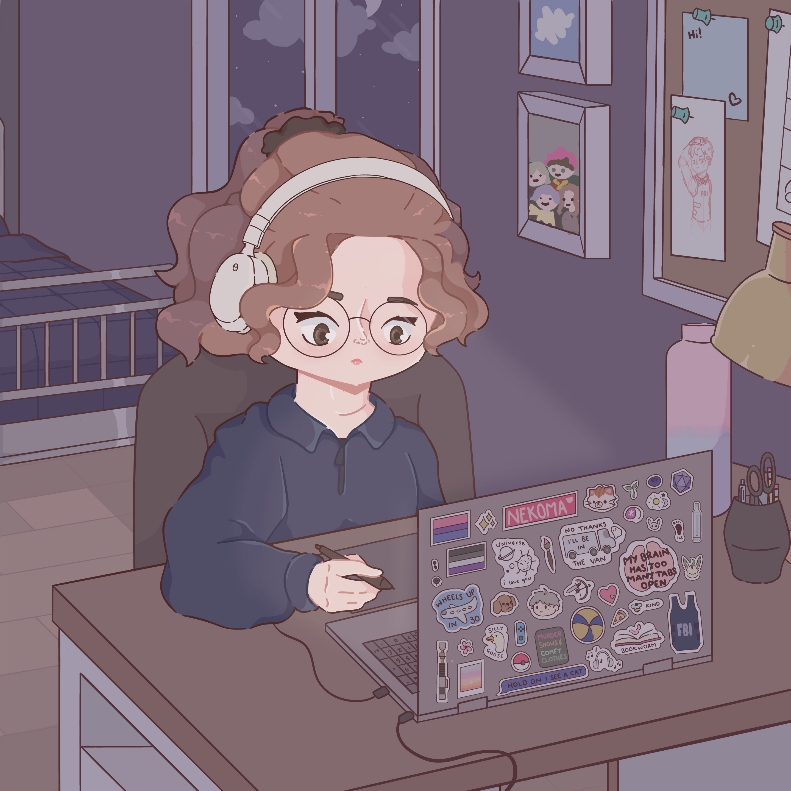

Welcome to my GitHub! 

 I believe that creative collaboration between design and technology is the magic that takes experiences from good to great. In my journey, I've experienced the world of SEO, where I learned a lot about good web development practices and recently I got a UX Design certification through a scholarship 100% funded by Google. 

Creating products that make people's lives easier is what keeps me motivated. I am also a big fan of dashboards and love building spreadsheets to track my goals.
  
I'm always challenging myself in hackathons and sharing my knowledge on LinkedIn!

<h3 align="left">My Stack</h3>

<h3 align="left">Technologies I'm learning</h3>

<h3 align="left">GitHub Stats</h3>

<be>

<h3 align="left">Currently</h3>

🎓 BSc in Informatics and Computing Engineering @FEUP

👀 Looking for a summer internship program

<h3 align="left">Connect with me!</h3>

<picture>
  <source
    media="(prefers-color-scheme: dark)"
    srcset="https://raw.githubusercontent.com/platane/snk/output/github-contribution-grid-snake-dark.svg"
  />
  <source
    media="(prefers-color-scheme: light)"
    srcset="https://raw.githubusercontent.com/platane/snk/output/github-contribution-grid-snake.svg"
  />
  
</picture>

