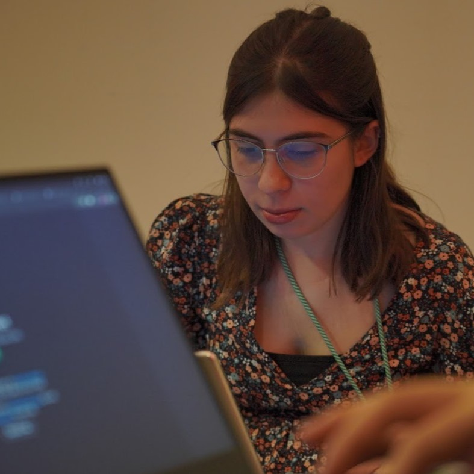

Welcome to my GitHub! 👋

 I am passionate about transforming people's lives through technology! I am very interested in algorithms, software development, and creating easy to use designs for my applications.

  
 🔭 Currently MSc in Computing Engineering and Smart Systems @[EHU](https://www.ehu.eus/es/home)
  
 🎓 BSc in Informatics and Computing Engineering @[FEUP](https://sigarra.up.pt/feup/pt/web_page.inicial)
  
🎨 Certified UX Designer by Google
  
<h4 align="left"> <a href="https://docs.google.com/document/d/153bGeB0R2hThXXXn_RF-zpdSJtw8rIEF/edit?usp=sharing&ouid=115411933896070971682&rtpof=true&sd=true"><code>📃Resume</code></a>

<h3 align="left">My Stack and Technologies</h3>

<h3></h3>

<picture>
  <source
    media="(prefers-color-scheme: dark)"
    srcset="https://raw.githubusercontent.com/platane/snk/output/github-contribution-grid-snake-dark.svg"
  />
  <source
    media="(prefers-color-scheme: light)"
    srcset="https://raw.githubusercontent.com/platane/snk/output/github-contribution-grid-snake.svg"
  />
  
</picture>

<h3 align="left">Connect with me!</h3>

<h2 align = "center" >Projects</h2>

| Project Name            | Description                                                                                                                                                   | Technologies |
|-------------------------|---------------------------------------------------------------------------------------------------------------------------------------------------------------|-------------|
| [🔵 AI Approach in Statistical Physics](https://github.com/AmandaTartarotti/ising-model-lso) | Machine Learning applied to physical systems, it achieves 99% accuracy in phase classification of a 2D Ising model | Python, PyTorch |
| [🔵 ML + Les Misérables](https://github.com/AmandaTartarotti/les-miserables-social-network-ml) | Graph ML & social network analysis, implements and compares 5 Machine Learning models (Naive Bayes, KNN, Neural Networks, Decision Trees, Random Forests) | Python |
| [🔵 Stock Portfolio Optimisation](https://github.com/afonsofernandess/StockPortfolioOptimisation) | AI tool that optimizes a stock portfolio performance using meta-heuristics algorithms | Python |
| [🔵 Diabetes Prediction](https://github.com/afonsofernandess/Diabetes-Prediction) | Applied Machine Learning in healthcare, the project evaluates multiple classifiers and analyzes model performance | Python | 
| [🔴BoardGame](https://github.com/AmandaTartarotti/ticktacktoe)  | Developed a board game following SOLID principles and implemented unit and mock testing with JUnit and Mockito. |    Java    |
| [🟢 Java-- Compiler](https://github.com/cosmintianu/jmm-compiler) | Implemented a full compiler pipeline from Java-- to OLLIR and Jasmin, covered parsing, semantic analysis, and code generation | Java |
| [🟢 AirED](https://github.com/AmandaTartarotti/aired)     | Airline Database Management System using several datastructures                                                                                        | C++        |
| [🟢 Water](https://github.com/peucastro/DA2324_PRJ1_G184) | A Water Supply Management Analysis Tool build through Algorithms that manipulate Graphs                                                                          | C++       |
| [🔴 Bomberman](https://github.com/AmandaTartarotti/bomberman_c)  | The classic Bomberman game implemented in C, focusing on low-level programming, core systems concepts and memory management | C        |
| [🔴 Doblin](https://github.com/AmandaTartarotti/doblin) | Strategic board game where players can compete against a computer bot | Prolog |
| [🔴 Martech](https://github.com/FEUP-LEIC-ES-2023-24/2LEIC13T1)     | Mobile marketplace to promote circular economy between university students  | Flutter        |

**Topic Legend**:
* 🔵 Machine Learning & Artificial Intelligence
* 🟢 Algorithms, Compilers & Systems Programming
* 🔴 Software Engineering, Games & Applications
